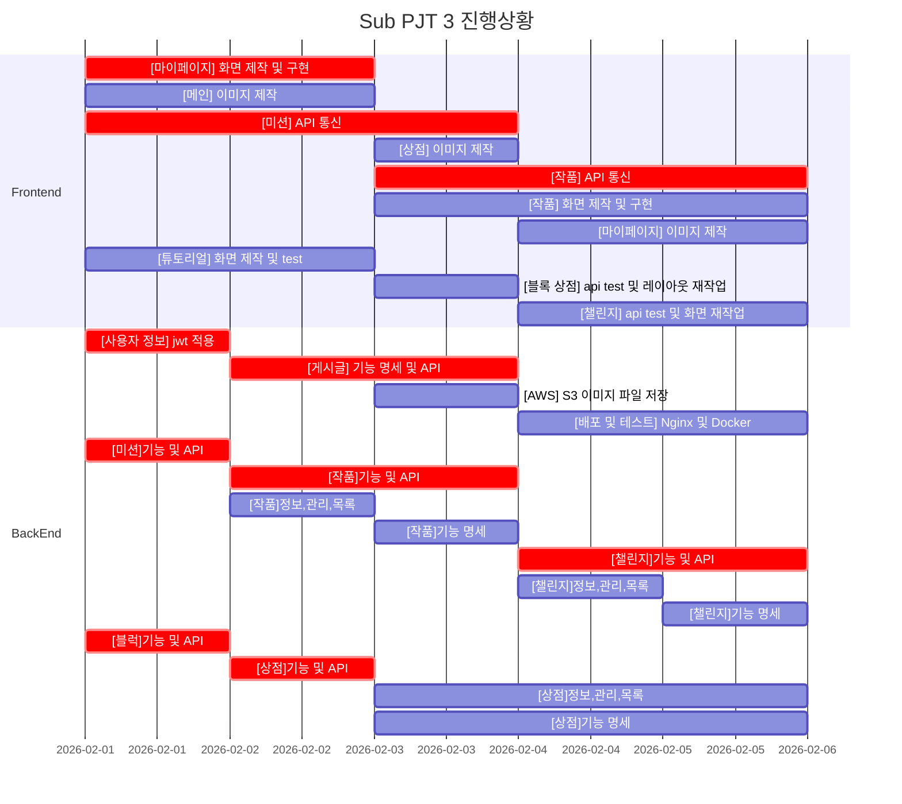

# 팀명 ( B205 )

### 팀장 : 황호연

### 팀원 : 구진범, 김다윤, 박승범, 성진옥

## 역할

**PM** : 성진옥

- 서비스의 목적 및 방향을 설계
- 화면 정의서 또는 와이어 프레임

**Tech Leader** : 김다윤

- 팀 내 기술적인 방향을 정하는 역할
- Git master ( MR 관리 / 코드리뷰 )

**QA** : 박승범 

- 기획 산출물을 기반으로 테스트 케이스를 작성 및 수행
- JIRA 관리 ( Spring 운명 및 관리 / Task 관리 )
- 테스트 케이스 및 수행 결과

**Developer** : 구진범, 김다윤, 박승범, 성진옥, 황호연

# 주제

## 프로젝트명 : 모여봐요

- 목적  : 주어진 문제를 해결하고, 공유하는 과정을 통해서 **사고력을 증진**시킬 수 있게 도와주는 웹 플랫폼이다.
- 목표 :  우리는 사고력 증진 도구로서 블록코딩을 이용할 수 있는 에디터를 제공하며, 각자 제작한 게시물을 공유함으로써 **다양한 생각과 접근의 경험**을 제공한다.

## 기능

- 미니홈피 ( 마이페이지 )

⇒ 미니룸 : 챌린지나 미션으로 주어진 아이템으로 꾸미기

⇒ 내가 구입한 블록 목록, 내가 가진 아이템 목록, 보유한 마일리지

⇒ 내가 작성한 미션, 답, 작품 목록 및 조회, 수정, 삭제

⇒ 내 정보 조회, 수정, 탈퇴

- 아이템

⇒ 상의, 하의, 신발, 헤어

⇒ 가구, 벽지, 바닥, 창문, 동물, 식물

- 블록(미션, 작품)

⇒ 보상 : 기본 아이템(랜덤박스) + 마일리지 부여

⇒ 구입한 블록으로만 미션을 풀거나 작품 제작이 가능

⇒ 미션을 만들 떄는 블록 갯수 및 종류 무제한

⇒ 검색필터

⇒ 같은 조건의 블록을 사용한 작품 목록 출력

⇒ 유저 이름으로 해당 유저의 미션이나 작품 검색

⇒ 작성순, 댓글순, 좋아요순, 조회수(작품), 참여순(미션)

⇒ 댓글 작성, 수정, 삭제(내 댓글만 삭제)

- 상점(블록)

⇒ 마일리지로 블록 구매

⇒ 해당 블록을 구입한 횟수만큼만 사용 가능하게

- 튜토리얼(미션)

⇒ blockly/games 그대로 튜토리얼로 가져오기

⇒ 단계별 보상 : 기본 아이템(랜덤박스) + 마일리지 부여

- 게시물 내용(BLockly)

⇒ 캐릭터는 우리가 주어준 거 안에서만 조종? 가능

⇒ 블록은 구입한 것 범위에서 사용 가능

- 챌린지(기간)(유저가 만든것중에 좋은거 챌린지로 올려도 되겠다.)

⇒ 특정기간에는 하나의 챌린지만 진행됨

⇒ 보상으로 챌린지 만의 희귀 아이템 제공

⇒ 유저가 만드는게 아니라 개발자들이 만들어서 진행 

⇒ 구입한 블록으로만 참여 가능

⇒ 성적 기준 : 미션을 성공했는데 블록을 적게 쓴 순서

⇒ 기준 안쪽은 최상 아이템

⇒ 기준 + 1개는 상 아이템

⇒ 기준 + 2개는 중 아이템

⇒ 여태 진행되었던 챌린지들의 목록(제목, 기간)

⇒ 클릭하면 이미 지난 챌린지라 볼 수 없다 alert 띄우기

- 공지사항 / 서비스 소개

## 기술 스택

### Backend

- Spring Data JPA, Spring Boot, MySQL

### Frontend

- React.js
- Redux, Redux-middleware

# Gantt Chart - Sub PJT 3 (02/01 - 02/19)
    

## Code Style ( Google Convention )

https://www.notion.so/Code-Style-Google-Convention-55fd2ffa3da04e29bd18fc9852fa8d25

## 디자인 컨셉

### : 동물의 숲